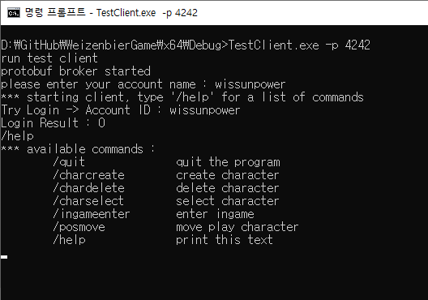

# WeizenbierGame

C++ 언어와 Actor Model을 기반으로 구성한 게임 서버 데모 프로젝트 입니다.

테스트를 위한 데모 클라이언트를 같이 제공합니다.

## Dependencies

해당 프로젝트에서 사용하는 외부 라이브러리를 간략하게 소개합니다. 아래 라이브러리들은 자체적으로 포함되어 있으므로 설치를 위한 별도의 과정은 필요없습니다.

### CAF: the C++ Actor Framework
Scala 언어의 Akka, .Net 언어의 Akka.net 와 같이 C++ 환경에서 Actor Model 을 지원하는 라이브러리 입니다.

* Homepage: https://www.actor-framework.org/
* Source Code(GitHub Repository): https://github.com/actor-framework/actor-framework

### protobuf
프로그래밍 언어, 플랫폼(OS 환경) 요인에 제약없이 확장성 높은 통신 방법을 제공하는 라이브러리 입니다.

* Homepage: https://developers.google.com/protocol-buffers/
* Source Code(GitHub Repository): https://github.com/protocolbuffers/protobuf

## 빌드 환경

* OS: Windows 
* IDE: Visual Studio 2019

## 실행

### 서버
* x64/Debug(혹은 Release)/ServerLauncher.exe 실행
* listen 포트를 설정할 수 있는 -p 옵션 제공
* 명령어 예: ServerLauncher.exe -p 4242 -> 4242번 포트로 서버를 실행
* 

### 테스트 클라이언트
* x64/Debug(혹은 Release)/TestClient.exe 실행
* 연결 대상 서버의 포트를 설정할 수 있는 -p 옵션 제공
* 

#### 기능별 프로토콜 테스트 모드(기본 모드)
* 서버에 구현된 프로토콜 기능을 확인하기 위한 모드
* 명령어 예: TestClient.exe -p 4242 -> 4242번 포트 서버로 접속 시도
* '/help' 명령어로 프로토콜 기능 종류 및 명령어 확인
* 

#### Bot 실행 모드
* 서버에 다수의 Bot(가상 클라이언트)을 연결하여 부하를 유발하기 위한 모드, 성능 확인 목적
* -b 옵션으로 Bot의 개수를 설정해야만 해당 모드로 실행
* 명령어 예: TestClient.exe -p 4242 -b 1000 -> 4242번 포트 서버로 1000대의 Bot 접속 시도
* 